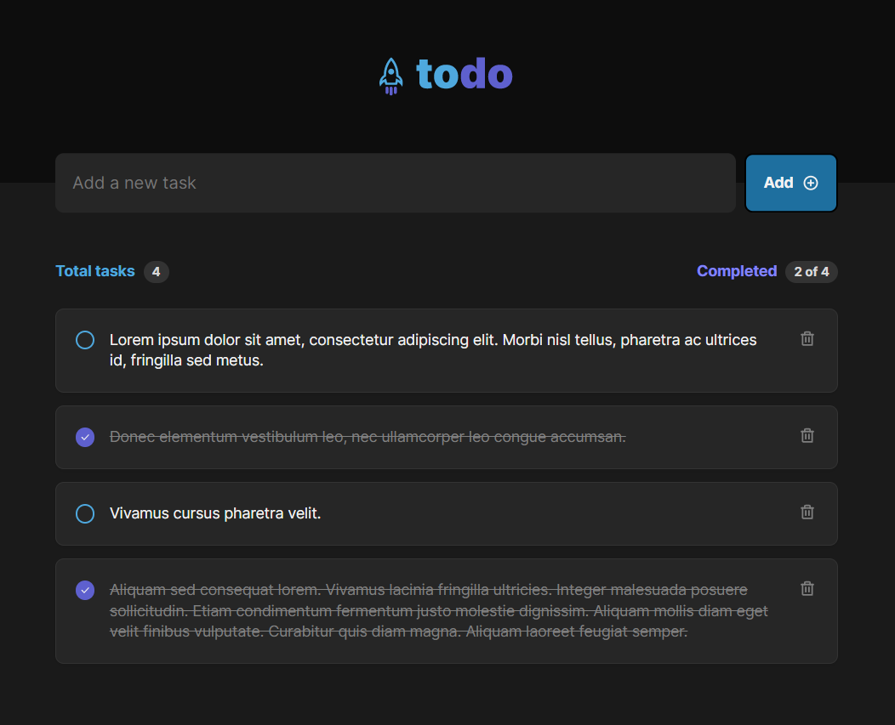

# To-do list

## Table of contents

- [The project](#the-project)
- [Screenshot](#screenshot)
- [Links](#links)
- [Built with](#built-with)
- [Project setup](#project-setup)

## The project

Task control application (to-do list style), which contains the following functionalities:

- Add a new task
- Mark and unmark a task as complete
- Remove a task from the list
- Show task completion progress

Covered concepts:

- States
- State immutability
- Lists and keys in ReactJS
- Properties
- Componentization

## Screenshot



## Links

- Live demo: [https://rct-to-do-list.netlify.app/](https://rct-to-do-list.netlify.app/)

## Built with

- Vite
- ReactJS
- TypeScript
- Radix

## Project setup
```
npm install
```

### Start dev server
```
npm run dev
```

### Build for production
```
npm run build
```

### Locally preview production build
```
npm run preview
```
